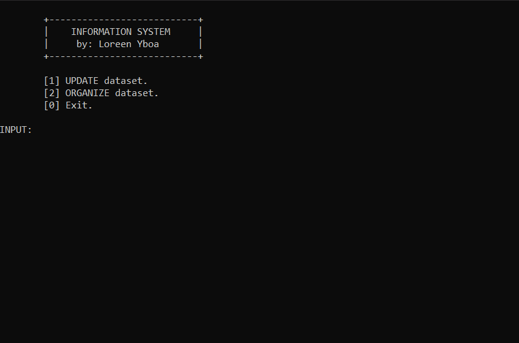

# 🎓 C++ Student Information System

> **Final Examination / Project in Data Structures and Algorithms**  
> *Developed by: Loreen Wilmer Yboa*

A fully functional **Student Information System** written in **C++**, designed to manage and organize student records efficiently.  
The system demonstrates key concepts in **Object-Oriented Programming (OOP)**, **Data Structures**, and **Algorithms**, specifically **Merge Sort** and **Linear Search**.

Here’s how the Student Information System works:



---

## 📘 Overview

The program manages a dataset of student records, allowing the user to:
- Add, search, update, and delete records  
- Display the dataset in a tabular format  
- Save and load data from a text file  
- Sort records using **Merge Sort** (by ID or Last Name)

The system uses a **vector** container to dynamically store records, each containing:
| Field | Description |
|--------|--------------|
| `ID` | Unique Student ID number |
| `Last Name` | Student's surname |
| `First Name` | Student's given name |
| `Age` | Student’s age |
| `Gender` | Male / Female |
| `Contact Number` | Student’s contact information |

---

## ⚙️ Features

### 🧭 Core Functionalities
- ➕ **Add Student** – Input a new student record  
- 🔍 **Search Student** – Find students by ID or last name (Linear Search)  
- ✏️ **Update Record** – Modify any field (ID, name, age, etc.)  
- ❌ **Delete Record** – Remove an entry by ID  
- 📋 **Display Dataset** – View all records in a formatted table  
- 💾 **Save Data** – Save all entries to `studentData.txt`  
- 📂 **Load Data** – Load records from a text file  
- 🔄 **Sort Data** – Sort by ID or Last Name using **Merge Sort**  

---

## 🧮 Algorithms & Data Structures

| Feature | Implementation |
|----------|----------------|
| Data Storage | `std::vector<studentRec>` |
| Sorting Algorithm | Merge Sort (by ID / Last Name) |
| Searching Algorithm | Linear Search (by ID / Last Name) |
| File Handling | `fstream` library for read/write |
| Programming Paradigm | Object-Oriented Programming (Classes and Methods) |

---

## 🧱 Code Structure

```
C++-Student-Information-System/
├── main.cpp               # Main program source file
├── studentData.txt        # Dataset file (auto-created)
├── LICENSE
└── README.md
```

### 🏗️ Major Classes

#### **`Operations`**
Implements sorting algorithms:
- `mergeSortInt()` — Merge Sort by ID  
- `mergeSortString()` — Merge Sort by Last Name  

#### **`Manipulations`**
Handles dataset manipulation:
- `addData()`, `searchData()`, `updateData()`, `deleteData()`  
- `displayDataset()`, `saveFile()`, `readFile()`  

#### **UI Functions**
- `userInterface()` — Main menu  
- `updateUI()` — Add, edit, delete, save, or load  
- `organizeUI()` — Sorting and display operations  

---

## 🚀 How to Run

### 🖥️ Requirements
- A C++ compiler (e.g., GCC, Clang, or MSVC)
- Terminal or IDE (Code::Blocks, Visual Studio, VS Code, etc.)

### 🧩 Compilation & Execution

**On Windows (MinGW or Code::Blocks):**
```bash
g++ main.cpp -o StudentInfoSystem.exe
StudentInfoSystem.exe
```

**On Linux / macOS:**
```bash
g++ main.cpp -o StudentInfoSystem
./StudentInfoSystem
```

---

## 📸 Example Interface (CLI)

```
+---------------------------+
|    INFORMATION SYSTEM     |
|     by: Loreen Yboa       |
+---------------------------+

[1] UPDATE dataset.
[2] ORGANIZE dataset.
[0] Exit.

INPUT:
```

**Display Dataset Example:**
```
ID   Last Name     First Name    Age  Gender    Contact No.
------------------------------------------------------------
1    Cruz          Ana           20   Female    09123456789
2    Reyes         John          21   Male      09987654321

No. of students: 2
No. of Male students: 1
No. of Female students: 1
Mean Age: 20
```

---

## 🧠 Learning Highlights

This project showcases:
- Efficient sorting with **Merge Sort**
- Searching through **Linear Search**
- File handling via **fstream**
- Modular OOP-based design
- Data analytics (mean age, gender count)
- Practical application of vectors and structs in C++

---

## 🧾 License

This project is licensed under the **MIT License** — see the [LICENSE](./LICENSE) file for details.

---

## 👩‍💻 Author

**Loreen Wilmer Yboa**  
💡 Data Structures and Algorithms Final Project  
📅 2023

---

⭐ *If you found this project helpful or educational, consider giving it a star on GitHub!*
